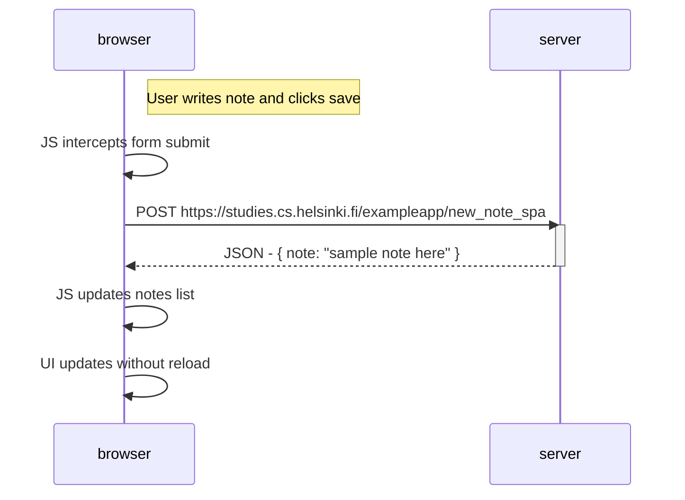

```mermaid
 sequenceDiagram
    participant browser
    participant server

    Note right of browser: User writes note and clicks save

    browser->>browser: JS intercepts form submit
    browser->>server: POST https://studies.cs.helsinki.fi/exampleapp/new_note_spa
    activate server
    server-->>browser: JSON - { note: "sample note here" }
    deactivate server

    browser->>browser: JS updates notes list
    browser->>browser: UI updates without reload
```
